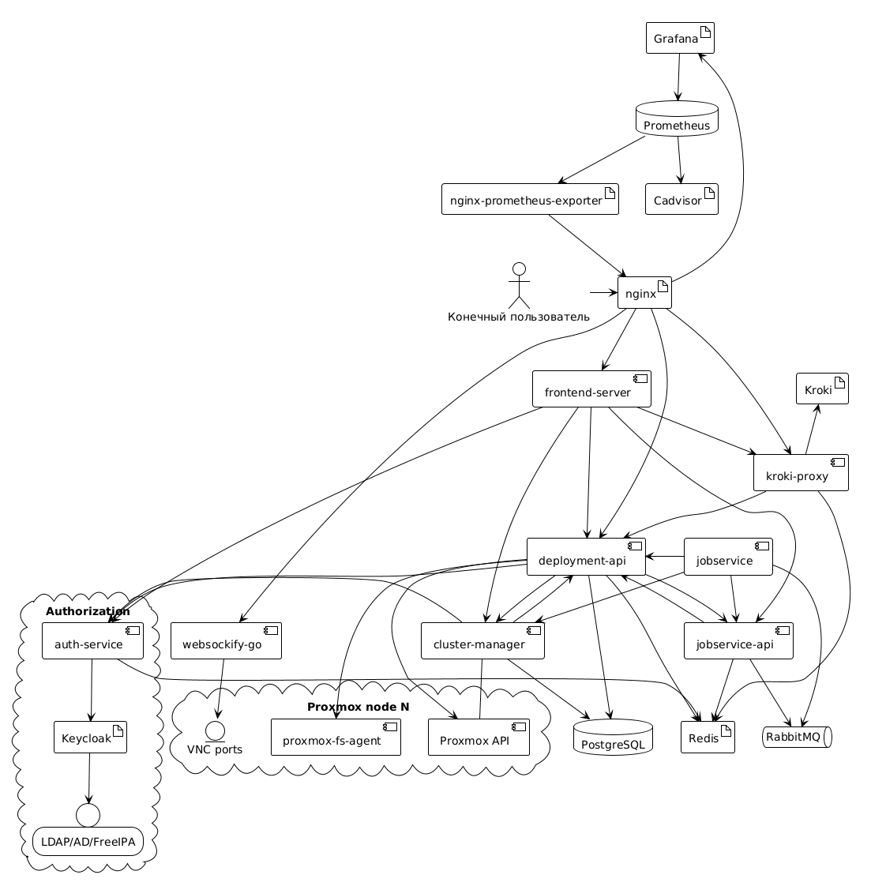

# Общее описание системы

Labforge - микросервисная система, главная задача которой - автоматическое массовое развертывание изолированных по умолчанию стендов Proxmox.

## Используемое стороннее ПО

В составе ПО используются следующие модули с открытым исходным кодом:

- [Kroki](https://kroki.io/)
- [Grafana](https://grafana.com/)
- [nginx-prometheus-exporter](https://github.com/nginx/nginx-prometheus-exporter)
- [Prometheus](https://prometheus.io/)
- [Cadvisor](https://github.com/google/cadvisor)
- [Keycloak](https://www.keycloak.org/)
- [Redis](https://github.com/redis/redis)
- [RabbitMQ](https://www.rabbitmq.com/)
- [PostgreSQL](https://www.postgresql.org/)

## Концепция работы сервисов

1. Микросервисы конфигурируются посредством переменных окружения либо `.env` файла. Подробнее в [конфигурации сервисов](./configuration.md)
2. Микросервисы используют сервис `auth-service` для авторизации между собой. Данный сервис позволяет авторизоваться в Keycloak и 
получить JWT токен
3. Микросервисы находятся в одной виртуальной сети и имеют возможность взаимодействовать между собой. *Альтернативный процесс в разработке*

## Задачи сервисов

Labforge состоит из группы сервисов, которые можно поделить на следующие группы:

1. **Мониторинг** - Grafana, nginx-prometheus-exporter, Prometheus, Cadvisor, Loki, Alloy. Данное ПО используется для сбора данных
мониторинга и его представления в виде дашбордов
2. **Авторизация** - auth-service, Keycloak. Первый сервис является прокси для передачи информации о пользователях и проведения
валидации JWT-токенов, Keycloak проводит OAuth2 авторизацию и интегрируется со сторонними источниками авторизации
3. **Развертывание** - cluster-manager, deployment-api, jobservice, jobservice-api. Отвечают за хранение данных Proxmox-узлов, шаблонов
развертывания и их выполнение
4. **Frontend** - frontend-server, kroki-proxy. Выполнение запросов от лица пользователей, визуализация данных.

Кроме этого, в состав системы входят вспомогательные компоненты:

- **websockify-go** - проксирование VNC-трафика по WebSocket до дисплеев виртуальных машин
- **proxmox-fs-agent** - агент на гипервизорах для корректировки параметров VM, закрытых для API Proxmox
- **nginx** - единая точка входа, маршрутизация и терминация TLS
- **Общие библиотеки** - `api-common`, `keycloak-api`, `proxmox-api`, `proxmox-deploy-toolkit`, `redis-utils` в каталоге `libraries/`. Подробнее в [документации библиотек](./libraries.md)

Подробное описание HTTP-интерфейсов сервисов доступно в [справочнике по API](./api.md).
Конвейер выполнения задач описан в [документации jobservice](./jobservice.md).

## Схема взаимодействия сервисов

[Исходный код схемы](./overview.uml)
