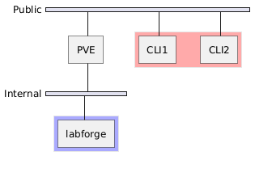
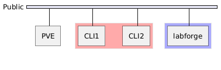

# Удаленное подключение

Стандартные механизмы подключения к виртуальным машинам в Proxmox предполагает наличие сессии в Proxmox,
чего в дизайне системы хотелось избежать для возможности гибкой настроки прав в рамках системы независимо
от гипервизора

Единственной альтернативой является открытие VNC порта для QEMU машин, где с точки безопасности представлено два
варианта: открытый порт и установка семизначного пароля. Кроме того, данная опция недоступна для изменения через API,
даже от пользователя `root` без разделения привилегий.

По этой причине дополнительно на каждую используемую ноду в развертывании требуется установить компонент `proxmox-fs-agent`.
Данный компонент представляет из себя HTTP API для коррекции VNC портов виртуальной машины

## Безопасность подключения

VNC-дисплей имеет номер, начиная с 1, который прослушивается по порту `5900 + номер`. Рекомендуем первую сотню портов оставить под
служебные цели при заведении хостов кластера в базу.

В целях безопасности, доступ к портам которые планируют использоваться должен быть **только** у сервера Labforge или того хоста, через
которого будет происходить проксирование.

## Дизайн топологии подключения

!!! note "Обозначения на схеме"

    **Public** - публичная сеть, из которой будут вестись подключения к Labforge

    **Internal** - внутренняя сеть для доступа к PVE. Может выступать кластерной сетью, внутренней сетью в случае развертывания на том же гипервизоре
    
    **Красным** выделены устройства, которые не должны иметь доступ к VNC-портам

    **Синим** выделены устройства, которые должны иметь доступ к VNC-портам

    **labforge** - обозначение сервера Labforge

    **CLI1, CLI2** - обозначение клиентских устройствов

    **PVE** - обозначение ноды Proxmox

=== "Сеть кластера/внутренняя сеть гипервизора"

    

    Вариант подключения через внутреннюю сеть, в которой используется
    кластерная сеть или создается виртуальная машина на самом гипервизоре
    и подключается удобным способом (SDN-сеть, внутренний сетевой интерфейс и.т.д).

    В таком случается требуется проброс портов веб-интерфейса Labforge (80, 443), либо дополнительное подключение к Public сети

=== "Публичная сеть"

    

    Вариант подключения в публичную сеть отдельного сервера или виртуальной машины на PVE с интерфейсом в Public сеть. Требуется
    статический IP-адрес и разрешительные правила на него со стороны гипервизоров.
