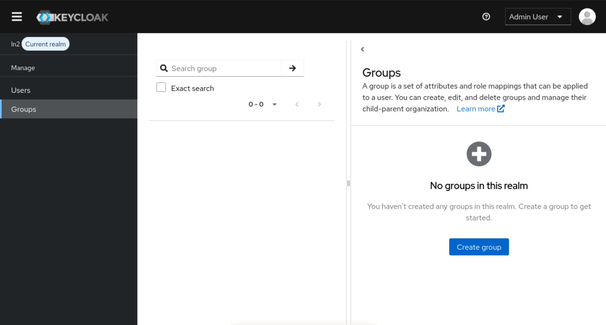
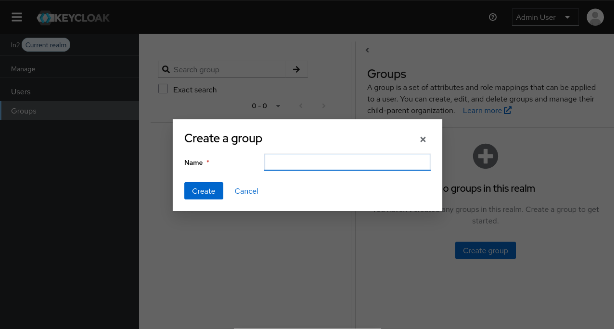
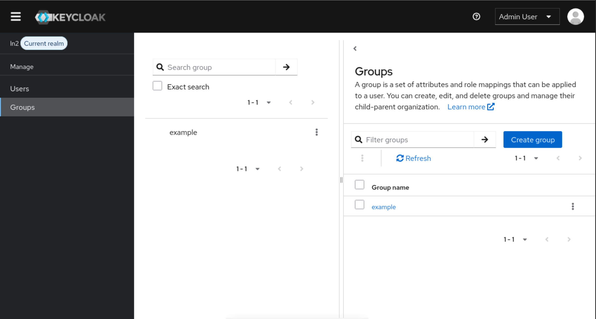
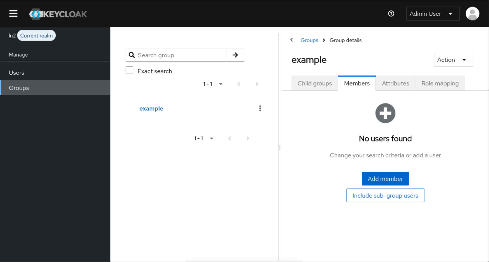
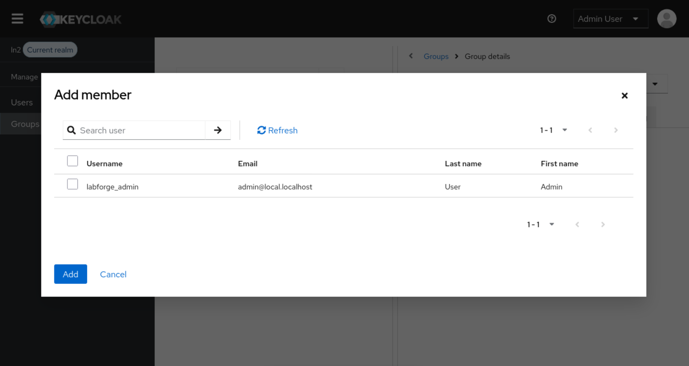
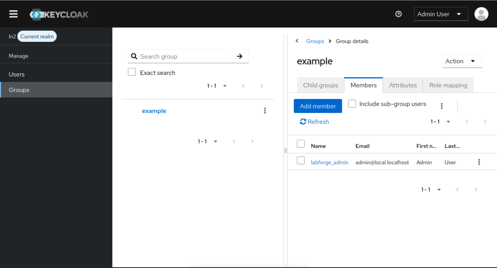

# Создание групп пользователей

Группы в Labforge используются для назначения на них операций по работе
со стендами. **Предварительно, требуется войти в Keycloak и перейти в Realm.** Как это
сделать вы можете ознакомиться [здесь](./entering-realm.md)

После успешного входа, выберите опцию "Groups":

Для создания группы нажмите кнопку "Create group"

Введите имя группы и нажмите "Create". 

Далее из удобной вкладки выберите новосозданную группу и нажмите на нее. В примере, выбирается группа из левой вкладки.

Выберите вкладку "Members" (участники) и нажмите на кнопку "Add member". Откроется окно выбора пользователей, выберите нужных
пользователей и нажмите "Add"

Для того, чтобы исключить пользователя из группы можно либо выбрать троеточие напротив пользователя и выбрать "Leave", либо выбрать
нескольких пользователей и через троеточие напротив кнопки "Add member" также выбрать "Leave"

