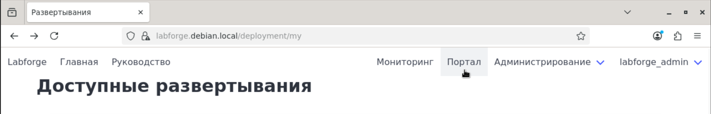
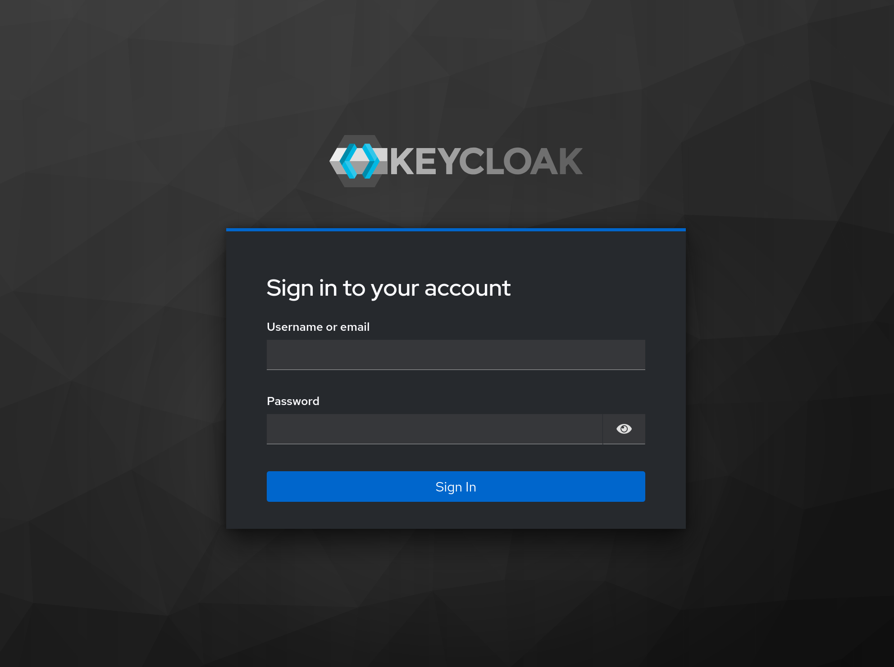
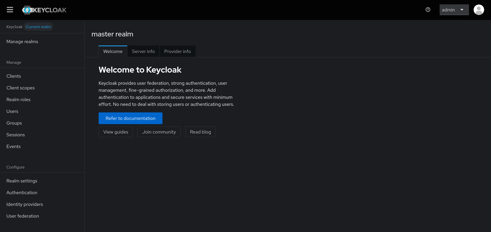
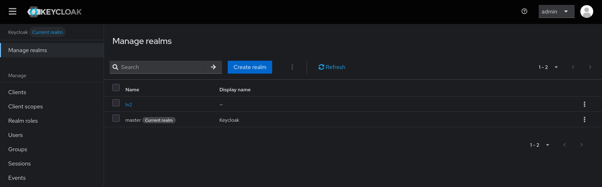
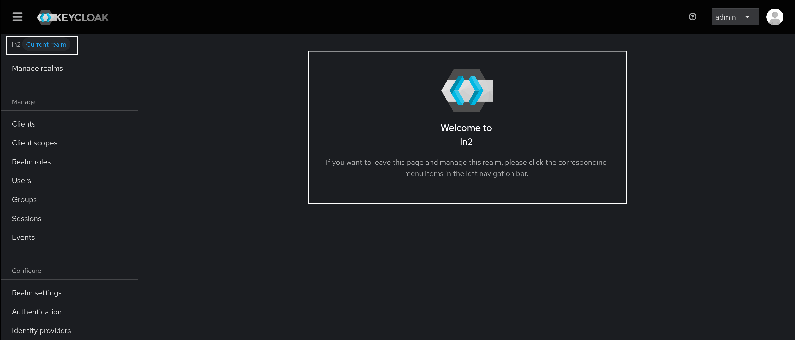

# Руководство по входу в Keycloak

## Если у вас есть УЗ для Labforge

Если у вас есть доступ, вы можете перейти в нужную область управления при помощи опции "Портал". При использовании
системных ролей, вам будет доступно управление пользователями и группами

## Вход через администратора Keycloak

После установки системы, воспользуйтесь доменом выделеным для системы авторизации и перейдите по нему. Вы увидите окно примерно следующего содержания:

Если вы не удаляли временного администратора, то можете воспользоваться данными из файла 
`docker.env` - полями `KC_BOOTSTRAP_ADMIN_USERNAME` и `KC_BOOTSTRAP_ADMIN_PASSWORD`. В противном случае, используйте
собственноручно созданные УЗ.

После успешного входа, вы попадете в главную страницу основного Realm'а.

!!! info "Что такое Realm'ы"

    Realm - изолированная область управления объектами, в том числе пользователями. Все данные, относящиеся к Labforge находятся
    в realm "ln2". Realm "Master" - стандартный Realm для управления Keycloak. В нем вы можете создавать администраторские УЗ
    для управления Keycloak, **но пользователями Labforge они не будут**.

Для перехода в нужный нам Realm воспользуйтесь опцией "Manage realms". Откроется список всех Realm:

Выберем нужный нам - ln2, нажав на его название. Мы попадем в аналогичную главной странице, но с надписью нашего Realm.

**Вы перешли в нужный Realm!** Можете вернуться к основному руководству, если пришли от него
