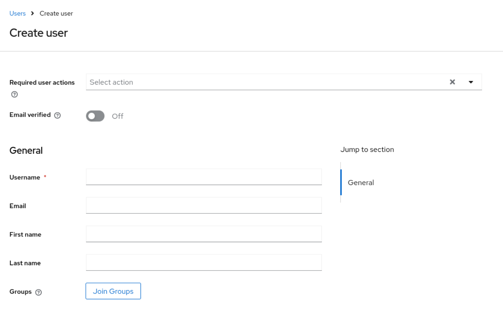
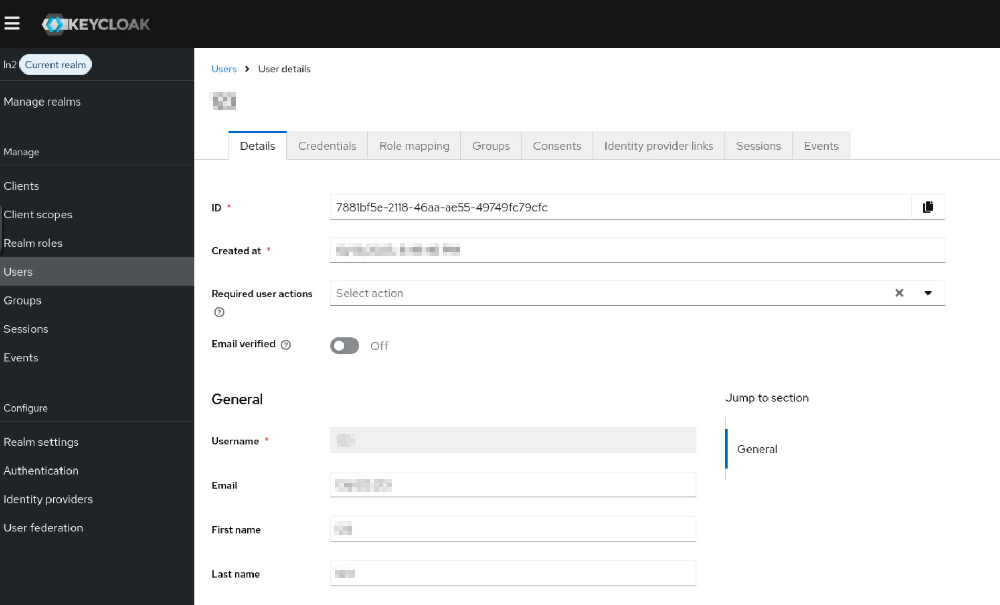
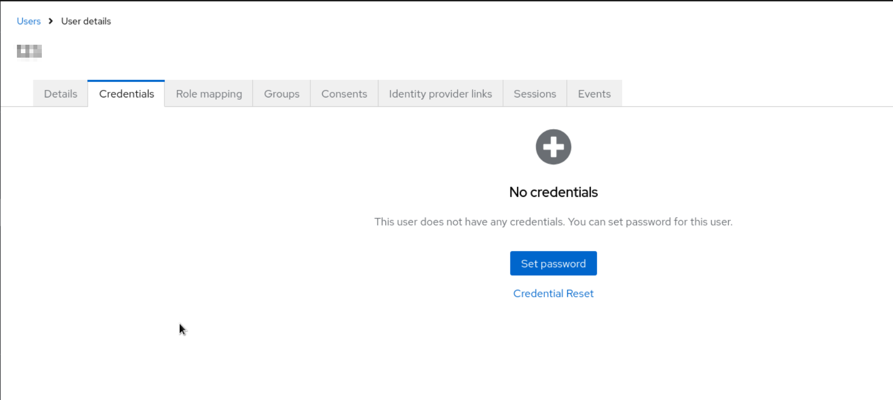
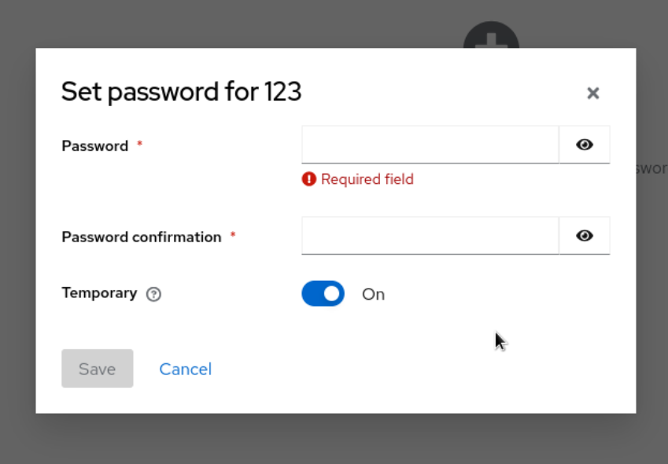

# Создание локальных пользователей

**Предварительно, требуется войти в Keycloak и перейти в Realm.** Как это
сделать вы можете ознакомиться [здесь](./entering-realm.md)

После успешного входа, выберите опцию "Users":

Нажмите на кнопку "Add user". Откроется меню создания пользователя:

Для создания пользователя минимально требуется логин - остальные данные в случае незаполнения будут запрошены при
первом входе. Укажите логин, почту, имя и фамилию. **Почта не должна быть действительной**. Также, если у вас есть созданные группы, можете в них добавить пользователя.
После, нажмите на кнопку "Create".

В случае успешного создания, вас перенаправят на страницу пользователя. Для возможности входа на пользователя нужно назначить пароль.

Для этого перейдите в раздел "Credentials" и нажмите на кнопку "Set password"

Далее, откроется форма ввода пароля, где потребуется его ввести дважды и также указать, временный ли это пароль.
Временный пароль действует при первом входе, далее потребуется его сменить.

Пользователь успешно создан и на него назначен пароль. Далее, вам могут пригодиться руководства:

- [по присвоению ролей пользователям](./users-role.md)
