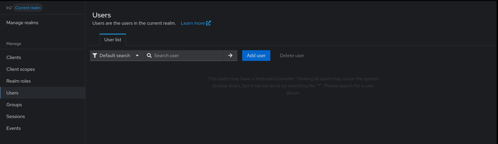
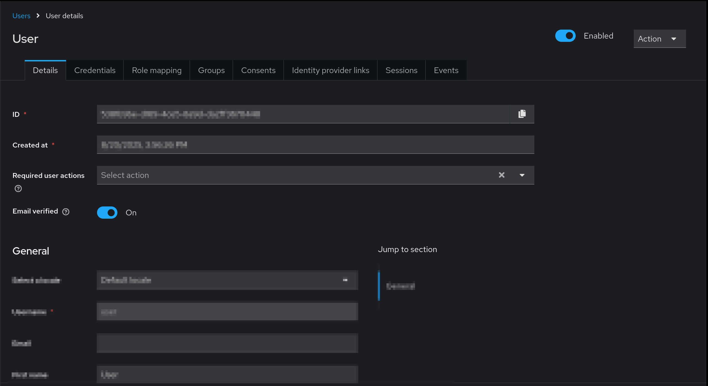
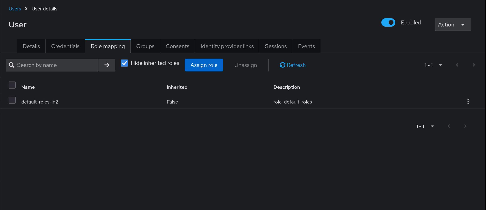
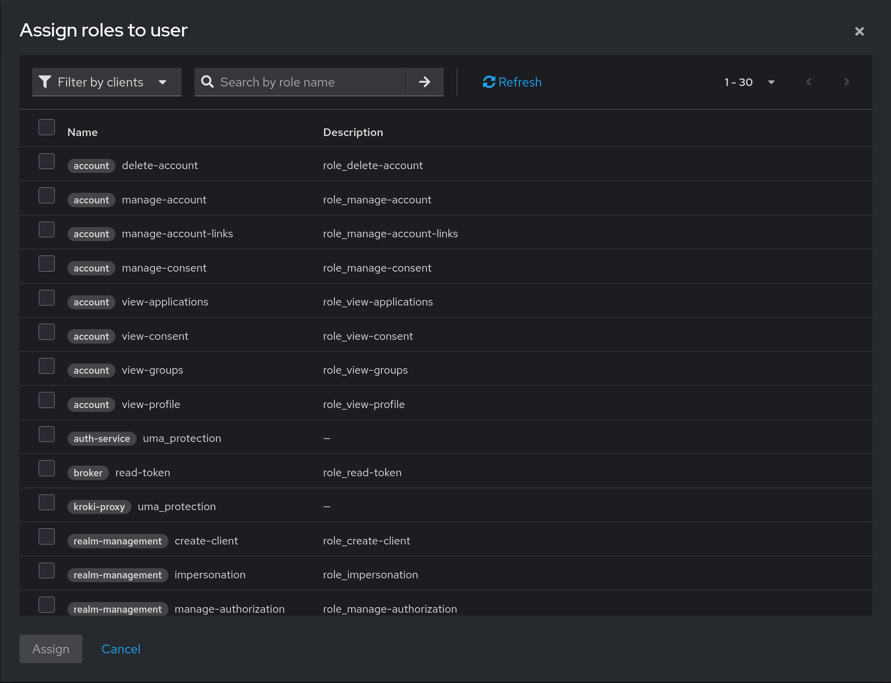
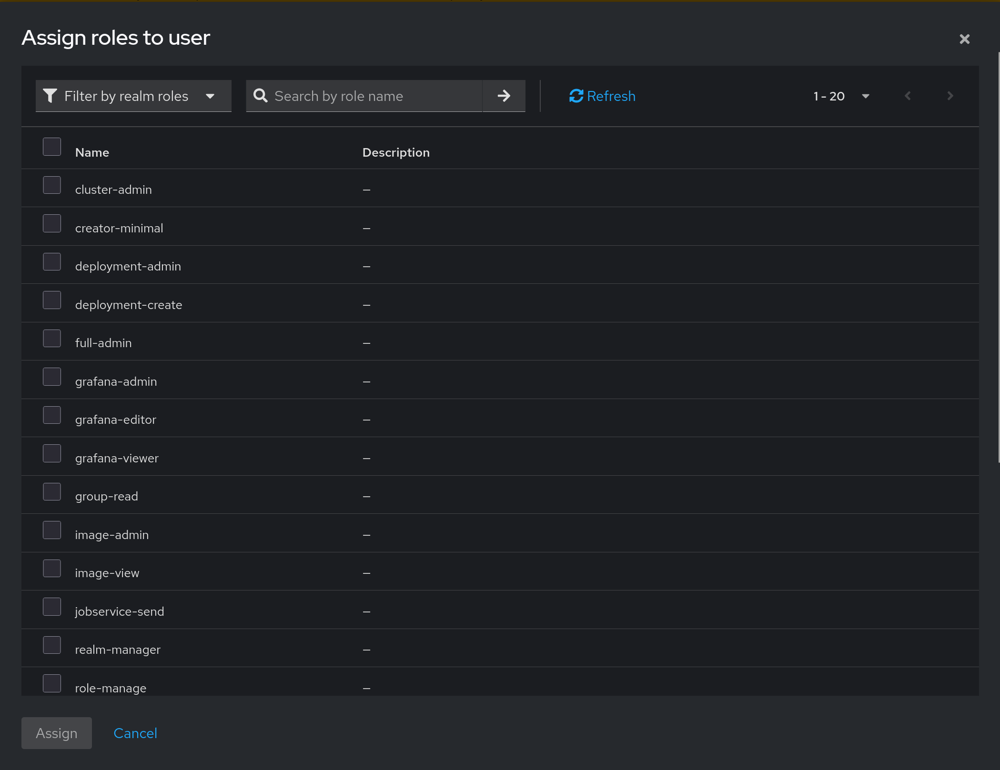

# Присвоение ролей пользователям

**Предварительно, требуется войти в Keycloak и перейти в Realm.** Как это
сделать вы можете ознакомиться [здесь](./entering-realm.md)

После успешного входа, выберите опцию "Users":

При помощи кнопок навигации или раздела поиска (поиск производится по
разным атрибутам) найдите нужного пользователя и перейдите на его
страницу, нажав на имя.

Далее, выберите вкладку "Role mapping". На ней вы можете увидеть присвоенные
роли и назначить новые. Нажмите на кнопку "Assign role" для этого.

По умолчанию в меню стоит фильтр, который отображает роли, созданные в системе
к каким-либо клиентам. 

Роли Labforge создаются на уровне Realm, поэтому переключите
фильтр со значения "Filter by clients" на "Filter by realm roles". 
Далее, выберите требуемые роли согласно списку. **Для доступа к системе
как пользователя дополнительных ролей не требуется**.

| Название роли | Описание |
|-|-|
|cluster-admin | Возможность удалять и добавлять новые хосты в сервисе `cluster-manager` |
|deployment-create | Возможность создавать шаблоны развертывания. Требуется доступ к образам - для чтения или редактирования |
|deployment-admin | Доступ ко всем созданным развертываниям. Включает в себя права роли `deployment-create` |
|deployment-alloc | Доступ к аллокации и резервации VMID и номеров дисплея. Служебная роль |
|deployment-instance-admin | Доступ к правке развертываний шаблона. Служебная роль |
|group-read | Дает read-only доступ к листингу групп в `auth-service`. Требуется для выполнения развертывания |
|image-admin | Дает полный доступ к списку шаблонов |
|image-view | Дает read-only доступ к списку шаблонов без права создания или удаления |
|role-manage | Дает права на управление ролями |
|role-read | Дает read-only права на роли |
|user-read | Дает read-only права на пользователей |
|validate-users | Дает возможность сервису `auth-service` направить запрос на валидацию JWT-токена |
|grafana-admin | Дает роль администратора в системе мониторинга |
|grafana-editor | Дает роль для редактирования объектов в системе мониторинга |
|grafana-viewer | Дает право просмотра системы мониторинга |
|realm-manager | Композитная роль. Дает пользователю право входа в "Портал" и настройки групп и пользователей Realm'а |
|full-admin | Композитная роль. Полный доступ ко всему. |
|jobservice-send | Дает право на отправку задач через `jobservice-api` |
|websockify-service | Служебная роль. Дает websockify-go право запрашивать у `cluster-manager` расположение ноды VM (`/api/cluster/vm/{vmid}/node`). Назначается служебному клиенту websockify |
|creator-minimal | Композитная роль. Включает в себя read-only доступ к образам и возможность создавать шаблоны развертывания |

Выберите нужные роли и после нажмите на кнопку "Assign". **Права обычно применяются при повторном входе конечного пользователя**
