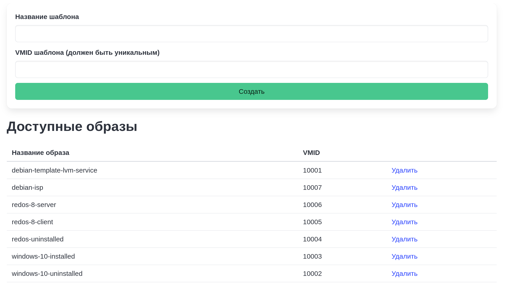

# Управление образами

Шаблоны виртуальных в системе Labforge хранятся в виде "VMID - название шаблона". Для корректной работы образов требуется, чтобы по
указываемому VMID:

1. Находился шаблон VM (не виртуальная машина) для возможности выполнения Linked Copy
2. Образ доступен со всех узлов кластера PVE
3. У образа не включена защита от удаления - в таком случае стенд нельзя будет удалить средствами Labforge

Для управления образами (удаление/создание) требуется роль `image-admin` (см. [руководство управления ролями](../keycloak/users-role.md)),
для чтения списков образов - роль `image-view`. После назначения данных ролей и повторного входа если у пользователя
имелась сессия ранее в верхнем меню появится опция "Администрирование", где будет доступна опция "Все образы".

На один VMID приходится одна запись образа, в ином случае при создании произойдет ошибка.
