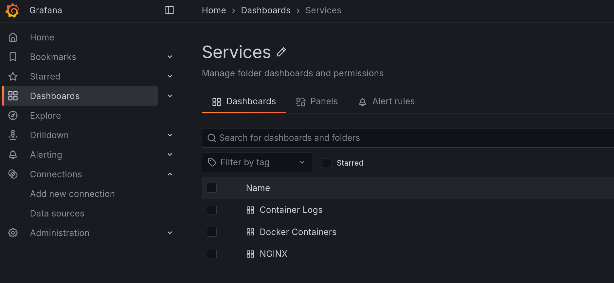
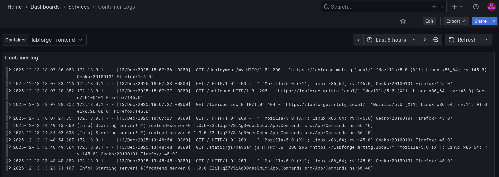

# Система мониторинга

Мониторинг доступен по ссылке `https://<основной домен>/grafana` или при нажатии опции "Мониторинг" в верхнем меню
основного интерфейса. Для доступа к системе [требуется роль `grafana-*`](../keycloak/users-role.md).

## Дашборды

Для доступа к системным дашбордам в боковом меню перейдите в опцию "Dashboards", далее в списке выберите папку "Services".

| Имя дашборда | Назначение |
|---|---|
|Docker Containers | Дашборд с статистикой расхода ресурсов контейнерами (CPU, память, диск, сеть) |
|Container Logs | Логи контейнеров хоста |

## Логи контейнеров

При открытии дашборда "Container Logs" вы можете выбрать в верхнем меню контейнер (опция "Container") и период времени в правом верхнем
углу. Также вы можете вручную обновить записи (логи передаются каждые 10 секунд) и настроить автообновление

